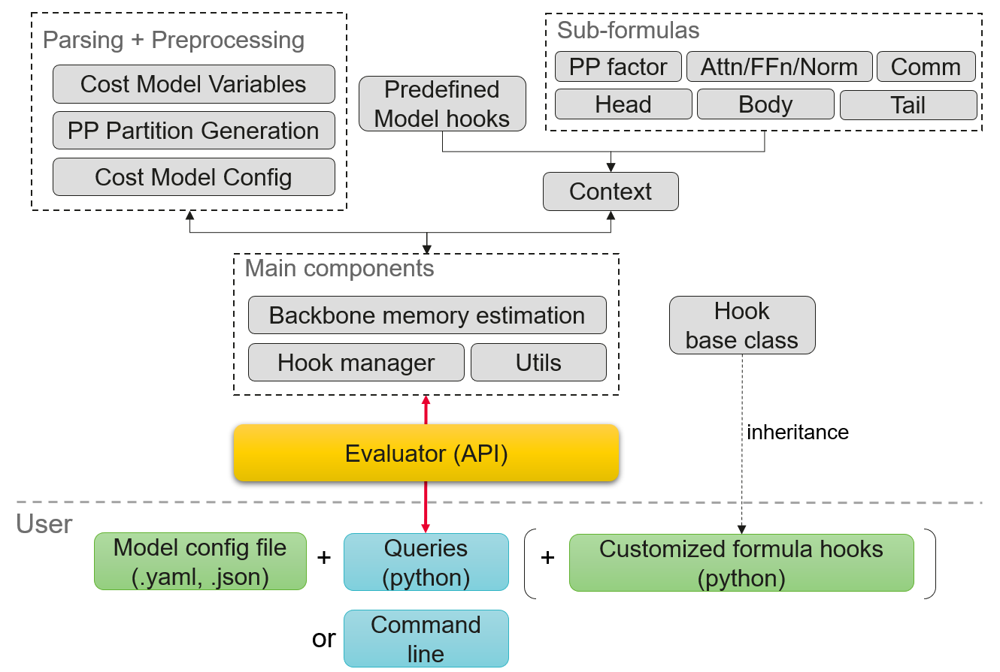
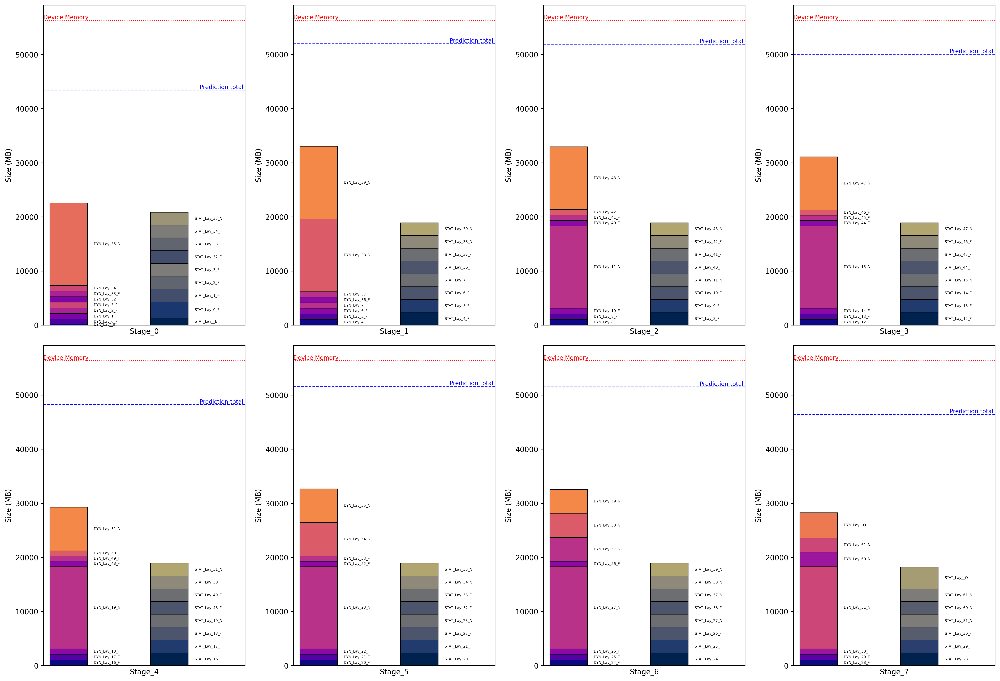

# MemEst: Symbolic Memory Estimation Tool for LLM Training with Parallelism

## 1. Overview 
This lightweight module estimates memory usage in large language model (LLM) training under various parallelism strategies. It predicts peak memory consumption (both static and dynamic), provides detailed memory insights, and can visualize results with plots.

Currently, it serves as a sub-module for ND and PPB, but it can also be used as a standalone tool. Its generic, customizable cost model enables fast, explainable predictions to guide memory-efficient training.


#### Supported features
- **LLM architectures** : Transformer-based (Llama2, Llama3, Mixtral, DeepSeekV3), Multimodal (XiaoYi)
- **Attention mechanisms** : Multi-Head Attention (MHA), Grouped/Multi-Query Attention (GQA, MQA), Flash Attention (FA), Multi-Head Latent Attention (MLA).
- **Feedforward mechanisms (FFN)** : standard FFN, Mixture of Experts (MoE): routed and shared experts, fixed capacity and dropless mode.
- **Parallelisms** : Data Parallelism (DP), Tensor Parallelism (TP), Megatron's Sequence Parallelism (SP), Context Parallelism (CP), Expert Parallelism (EP), Pipeline Parallelism (PP), and ZeRO-DP.
- **Pipeline schedulings** : 1F1B, SeqPipe, DualPipeV, Virtual Pipeline Parallelism (VPP)
### A. Inputs
Essentially, just a LLM configuration. It currently handles MindFormers YAML and MindSpeed JSON (multimodal).
### B. Steps
- Parse input, initialize cost model variables, fetch and apply hooks on cost model
- Generate partitions of layers (pipeline stages, chunks)
- Foreach pipeline stage, estimate forward pass peak memory and backward pass overhead
- Answer user's queries (fit in device, insights, plots, layer description)
## 2. How to use
### A. Installation
Require Python 3.9 and `pyyaml` module. Additionally, `matplotlib` and `pillow` modules are needed for plotting tasks.
### B. Example
#### with commandline
Input
```
python estimate_v2.py model_experiments/telecom/1119b.yaml --fit --verbose --plot --hook Telecom
```
Output
```
memory_estimation [_backbone.py:125] - INFO - ============ Process config file: model_experiments/telecom/1119b.yaml
memory_estimation [_backbone.py:449] - INFO - Partition of layers :
memory_estimation [cost_model_preprocess.py:116] - INFO - stage _0 : [['1E', '4F'], ['3F', '1N']]
memory_estimation [cost_model_preprocess.py:116] - INFO - stage _1 : [['4F'], ['2F', '2N']]
memory_estimation [cost_model_preprocess.py:116] - INFO - stage _2 : [['3F', '1N'], ['3F', '1N']]
memory_estimation [cost_model_preprocess.py:116] - INFO - stage _3 : [['3F', '1N'], ['3F', '1N']]
memory_estimation [cost_model_preprocess.py:116] - INFO - stage _4 : [['3F', '1N'], ['3F', '1N']]
memory_estimation [cost_model_preprocess.py:116] - INFO - stage _5 : [['3F', '1N'], ['2F', '2N']]
memory_estimation [cost_model_preprocess.py:116] - INFO - stage _6 : [['3F', '1N'], ['1F', '3N']]
memory_estimation [cost_model_preprocess.py:116] - INFO - stage _7 : [['3F', '1N'], ['2N', '1O']]
memory_estimation [_backbone.py:455] - INFO - Flatten layer_custom_config
['hook_dense_custom_lay_shard', 'hook_moe_custom_lay_shard', ...]
memory_estimation [_backbone.py:546] - INFO - stage_id=0, chunk_id=0, lay_id=0, node=LayerType.EMBEDDING_LAYER
memory_estimation [cost_model_preprocess.py:133] - INFO - deepseekV3 Parallelism used :
memory_estimation [cost_model_preprocess.py:134] - INFO - DP 256, TP 2, PP 8, EP 64, CP 1, VPP 2
memory_estimation [cost_model_preprocess.py:143] - INFO - d_exp 4, t_exp 2, os_max_shard 512, etp 0
memory_estimation [cost_model_preprocess.py:150] - INFO - shard_grad_exp 128, shard_grad_non_exp 2
memory_estimation [cost_model_preprocess.py:155] - INFO - shard_p_os_exp 512, shard_p_os_non_exp 512
memory_estimation [cost_model_preprocess.py:160] - INFO - shard_embed 512, shard_output_activ 1, shard_rec_input 2
memory_estimation [_backbone.py:526] - INFO - Apply hook hook_dense_custom_lay_shard
memory_estimation [_backbone.py:546] - INFO - stage_id=0, chunk_id=0, lay_id=1, node=LayerType.FULL_REC_LAYER
...
memory_estimation [_backbone.py:526] - INFO - Apply hook hook_moe_custom_lay_shard
memory_estimation [_backbone.py:546] - INFO - stage_id=7, chunk_id=1, lay_id=1, node=LayerType.NOT_REC_LAYER
...
memory_estimation [_backbone.py:546] - INFO - stage_id=7, chunk_id=1, lay_id=2, node=LayerType.OUTPUT_LAYER
...
memory_estimation [_backbone.py:695] - INFO - stage _1 : 55647 MB
memory_estimation [_backbone.py:700] - INFO -   Static  18941   ModelParam 2180 (12%), OptimStates 4361 (23%), Gradients 12399 (65%)
memory_estimation [_backbone.py:713] - INFO -   Dynamic 36706   Attn 7686 (21%), FFn 16005 (44%), Norm 1200 (3%), AllGather Comm 7470 (20%), All2All Comm 2400 (7%),
memory_estimation [_backbone.py:732] - INFO -   Node eval log :
 > Foreach: (stage_id,chunk_id,lay_id,name) -> (mem type,value)
 {(1, 0, 4, 'F'): {'_activ': 208, '_comm': 830, '_param': 2367, 'accu_grad': 1549, 'ag_comm': 830, 'attn_activ': 48, 'model_param': 272, 'optim_state': 545},
 (1, 0, 5, 'F'): {'_activ': 208, '_comm': 830, '_param': 2367, 'accu_grad': 1549, 'ag_comm': 830, 'attn_activ': 48, 'model_param': 272, 'optim_state': 545},
 (1, 0, 6, 'F'): {'_activ': 208, '_comm': 830, '_param': 2367, 'accu_grad': 1549, 'ag_comm': 830, 'attn_activ': 48, 'model_param': 272, 'optim_state': 545},
 (1, 0, 7, 'F'): {'_activ': 208, '_comm': 830, '_param': 2367, 'accu_grad': 1549, 'ag_comm': 830, 'attn_activ': 48, 'model_param': 272, 'optim_state': 545},
 (1, 1, 36, 'F'): {'_activ': 188, '_comm': 830, '_param': 2367, 'accu_grad': 1549, 'ag_comm': 830, 'attn_activ': 48, 'model_param': 272, 'optim_state': 545},
 (1, 1, 37, 'F'): {'_activ': 188, '_comm': 830, '_param': 2367, 'accu_grad': 1549, 'ag_comm': 830, 'attn_activ': 48, 'model_param': 272, 'optim_state': 545},
 (1, 1, 38, 'N'): {'_activ': 11481, '_comm': 1950, '_param': 2367, 'a2a_comm': 1120, 'accu_grad': 1549, 'ag_comm': 830, 'attn_activ': 3452, 'ffn_activ': 7469, 'model_param': 272, 'norm_activ': 560, 'optim_state': 545},
 (1, 1, 39, 'N'): {'_activ': 11481, '_comm': 1950, '_param': 2367, 'a2a_comm': 1120, 'accu_grad': 1549, 'ag_comm': 830, 'attn_activ': 3452, 'ffn_activ': 7469, 'model_param': 272, 'norm_activ': 560, 'optim_state': 545},
 (1, 1, 'G_39', 'N'): {'_activ': 1640, '_comm': 990, 'a2a_comm': 160, 'ag_comm': 830, 'attn_activ': 493, 'ffn_activ': 1067, 'norm_activ': 80}}
...
memory_estimation [_backbone.py:289] - INFO - Plotting predictions in plots/
memory_estimation [_backbone.py:302] - INFO - save plot: plots/MemPlot_stage_0.png
...
memory_estimation [_backbone.py:302] - INFO - save plot: plots/MemPlot_stage_7.png
memory_estimation [_backbone.py:327] - INFO - save stage plot: plots/MemPlot_all_stages.png
memory_estimation [estimate_v2.py:72] - OUTPUT - model_name: deepseekV3, peak memory : 55647 MB (stage _1)
memory_estimation [estimate_v2.py:165] - OUTPUT - estimation FITS into device memory (55647<=55.00GB-0MB)
``` 


#### with API
Refer to tutorial script `demo.py`.
### C. Complete Usage
```
python estimate_v2.py --help
usage:  estimate_v2.py 
        [-h] [--verbose] [--plot] [--fit] [--stage STAGE] 
        [--hook HOOK] [--tracefun TRACEFUN] [--ppb] 
        [--ctx] [--ccfg] [--warnings] model_config_path

Command line usage: Estimate peak stage memory

positional arguments:
  model_config_path    Model config file (MindFormer YAML or MindSpeed JSON)

options:
  -h, --help           show this help message and exit
  --verbose            Show estimation trace
  --plot               Plot estimation
  --fit                Check if estimation fits in device memory
  --stage STAGE        Specify pipeline stage ID
  --hook HOOK          Specify hook class (defined in hooks/)
  --tracefun TRACEFUN  Specify a formula function name to get it traced
  --ppb                Generate pipeline balancing layers description
  --ctx                Show ctx variables
  --ccfg               Show ccfg variables
  --warnings           Show warnings
```
## 3. Structure
```bash
memory_estimation/
├── configs_eval/               # Evaluator configs
├── comparators/                # [Experimental] Predict/Profile analysis
├── evaluators/        
│   ├── body.py                 # Layer level formulas         
│   ├── comm.py                 # Communication volume formulas
│   ├── head.py                 # Head layer formulas
│   ├── layer_block.py          # Layer blocks/operators level formulas
│   ├── tail.py                 # Tail layer formulas
│   └── utils.py                # Auxiliary formulas and functions
├── hooks/                      # Predefined hooks collection
├── plots/                      # Generated plots folder
├── test_cases/                 # YAML model files + real memory insights
├── tests/                      # UT/ST
├── _backbone.py                # Base class for evaluator
├── _bwd_overhead.py            # Backward overhead compute for backbone
├── _context.py                 # Context class
├── _func_tracer.py             # [Experimental] Formula execution trace
├── _hook_manager.py            # HookManager class
├── _utils.py                   # Getters, Setters, Printers
├── demo.py                     # Example script
├── estimate_v2.py              # Main module [API calls]
├── hook_base.py                # Abstract hook class
├── logger.py                   # Logger setting
├── README.md                   # This file
└── score.py                    # For cost model's quality testing
```
## 4. Documentation
### 4.1. Evaluator, LayerType
```python
e = EvaluatorV2(config, log_level, eval_yml, hook_cls)
'''
Arguments
- 'config' : Model configuration file path (MindFormers YAML or MindSpeed JSON) or Config object
- 'log_level' : 1 or 0 to toggle on or off warning messages (1 by default)
- 'eval_yml' : Evaluator configuration file path (Use configs_eval/default.yaml by default)
- 'hook_cls' : MemEvalHook object or string (None by default)
'''
```
`EvaluatorV2` heavily relies on the definition of its private attributes `ccfg` and `ctx` when computing. 
- `ccfg` is a `CostModelConfig` object built after parsing the model configuration. It stores almost all the variables used in the cost model's formulas. 
- `ctx` is a `Context` object which assists the evaluator in the computation. It indicates when to use which formulas, accumulates temporary results and stores the computation traces. It also stores additional variables that are not available in the model configuration but used in the cost model.

The evaluator processes any LLM architectures by representing them with an abstract and generic structure. Each layer is associated with a `LayerType` element:
- `LayerType.NOT_REC_LAYER` for regular layers without recomputation 
- `LayerType.SEL_REC_LAYER` for regular layers with selective recomputation
- `LayerType.FULL_REC_LAYER` for fully recomputed regular layers
- `LayerType.EMBEDDING_LAYER` for embedding layer
- `LayerType.OUTPUT_LAYER` for output layer

Before estimating memory, the evaluator automatically generates each pipeline stage's layer partitions according to input recomputation, offset and pipeline scheduling settings.

Thus, layer partitions are defined as
$\{l[s][c] \mid s \in [0,\text{PP degree}[\:\wedge\: c \in [0,\text{VPP degree}[\:\wedge\:l[s][c] \in LayerType \}$

Moreover, `ctx.eval` maps formulas for contextually defined `LayerType` (shortcut for `ctx.node_eval[ctx.current_node]`) :
- *ctx.eval.num_p()* function returns a tuple of (number of non-experts of parameters, number of expert parameters) for regular layers, and a float value otherwise.
- *ctx.eval.stat.p()* function returns the static memory of model parameters (float)
- *ctx.eval.stat.os()* function returns the static memory of optimizer states (float)
- *ctx.eval.stat.grad()* function returns the static memory of accumulated gradients (float)
- *ctx.eval.dyn.activ()* function returns the activation memory (float)
- *ctx.eval.dyn.comm.dp()* function returns the DP communication overhead (float)
- *ctx.eval.dyn.comm.tp()* function returns the TP communication overhead (float)
- *ctx.eval.dyn.comm.cp()* function returns the CP communication overhead (float)
- *ctx.eval.dyn.comm.ep()* function returns the EP communication overhead (float)

For Transformer layers, above functions rely on finer-grained formulas to compute memory for Attention block, FFN block and Normalization :

- The Attention block needs formulas to compute the number of non-expert parameters [*attn.num_p*], the QKV activations [*attn.qkv*], the attention score activations after Softmax [*attn.score*], and the output projection activations [*attn.proj*].
- The FFN block needs formulas to compute the number of expert parameters [*ffn.num_p*] and the activations [*ffn.activ*].
- The Normalization also needs formulas to compute part of non-experts parameters [*norm.num_p*] and the activations [*norm.activ*].

### 4.2. Evaluator's general functions
|Functions|Argument types|Descriptions|
|---------|--------------|------------|
|**Initialization**|
|*e.update_config(new_config)* |`str`|(Re)Initialize evaluator with given model configuration path or object| 
|*e.reset_config()* | |Reset evaluator with current model configuration|
|*e.load_hook_cls(hook_cls)* |`MemEvalHook`|Load an instance of hook class|
|**Memory Estimation**|
|*e.estimate_peak(stages, verbose,spec_stage_id,plot)* |`List[List[LayerType]], bool,int,bool`|*All arguments are optional* ─ Estimate peak stage memory. Possibility to specify layers partitions, activate verbose mode, specify a pipeline stage, lot results|
|*e.estimate_peak_insight(stages)* |`List[List[LayerType]]`|*Optional layer partitions* ─ Output a dictionary of memory insights.|
|*e.estimate_layer_memory( stages,device_type)* |`List[List[LayerType]]`|*Optional layer partitions* ─ PPB's input format. Memory insight without without num microbatches factors. |
|*e.mem_fit(mem,tolerance,margin)* |`(int\|float)*3`|Check if given memory (in Megabytes) fits in processor's memory capacity. Tolerance threshold and capacity's lower bound margin are optional.|
|*e.static_mem_stage(stage_id)* |`int`|Estimate static memory for a given pipeline stage|
|*e.dynamic_mem_stage(stage_id)* |`int`|Estimate peak dynamic memory for a given pipeline stage|
|*e.logs_mem_stage(stage_id)* |`int`|Output the estimation trace logs for a given pipeline stage|
|*e.static_mem_layer(node,stage_id)* |`LayerType, int`|Estimate static memory for `LayerType` layer(s) from a given pipeline stage|
|*e.dynamic_mem_layer( node,stage_id)* |`LayerType, int`|Estimate peak dynamic memory for `LayerType` layer(s) from a given pipeline stage|
|*e.all_stage_micro_factors()* | |Output all computed num microbatches factors (useful to inspect pipeline scheduling)|
|*e.mb(val)* |`int\|float`|Convert bytes to Megabytes|
|**Pretty printers**|
|*e.print_ccfg()* | |Print `ccfg` attribute contents|                          
|*e.print_ctx()* | | Print `ctx` attribute contents|       
|*e.print_stages(stages, spec_stage_id)* |`List[List[LayerType]], int`|Print the whole layers partitions. Specifying ID is optional|
|**Getters**|
|*e.get_model_name()*||Return the LLM model's name|
|*e.get_strategy()*||Return a dictionary of {dp,tp,ep,cp,vpp,gbs,sched}|
|*e.get_max_device_memory()*||Returns the processor's memory capacity|
|*e.get_num_layers()*||Return the number of layers, or a tuple if it's multimodal|

### 4.3. Cost model variables (`ccfg`)

|Variables|Descriptions|
|---------|------------|
|*config*|The pointer to the parsed input config|
|*model_name / device_capacity*|LLM Model's name, processor's memory capacity.|
|*multimodal / freeze / mm_ccfgs*|Multimodal flag, frozen training flag, dictionary of CostModelConfig for submodules.|
|*has_op, has_grad_shard, has_fa, has_clip, freeze, gmm, vocab_emb_dp*|Feature toggle flags for ZeRO-2, ZeRO-3, FA, Gradient clipping, Model freezing, Grouped GEMMs, Vocabulary splitting. |
|*d / t / p / ep / sp / cp / vp / os_max_shard* | *(Read-Only)* DP, TP, PP, EP, Megatron SP, CP, VPP parallelism degrees, partial ZeRO group size. <br>Some ZeRO/MoE-related sharding variables are dependent on the values of *d, t, os_max_shard*.|
|*shard_p_os_non_exp_partial / shard_p_os_non_exp / shard_grad_non_exp* / *shard_p_os_exp_partial / shard_p_os_exp / shard_grad_exp*|Sharding factors for static memory using ZeRO (non-experts and experts parameters). Respectively for model parameters + optimizer states (full ZeRO or partial ZeRO group size), accumulated gradients.|
|*pp_sched, n_s_split, cp_algo*|Pipeline scheduling, Sequence split degree for SeqPipe, CP algorithm used (currently supports ColossalAI and Ulysses).|
|*n_lay / h / hff / v / s / s_fa*|Number of layers, Hidden size, FFN hidden size, Vocabulary size, Sequence length, FA sequence chunk size.|
|*n_attMM / n_attBMM / n_attParamCast / n_softmax / n_normOp / n_gather / n_dropout*|Number of operators in a layer. Respectively attention MatMul, attention BatchMatMul, attention parameter Cast, Softmax, Normalization, Gather, Dropout.|
|*shard_embed / shard_output_activ / shard_recompute_input*|Sharding factors for embedding layers activations, output layers activations and checkpointed layers input activations.|
|*a / n_kv / dh*|Number of attention (query) heads, Number of KV heads, Per head dimension.|
|*dc_kv / dc_q / dhr*| *(MLA related) ─* KV compression dimension, Q compression dimension, QK per head dimension for RoPE.
|*b / m / gbs*|Microbatch size, Number of microbatches, Global batch size.|
|*n_exp / n_chosen_exp / n_shared_exp*|*(MoE related) ─* Number of routed experts, Top-k routed experts, Number of shared experts.|
|*cap_fact / hff_exp / t_exp / d_exp*|*(MoE related) ─* Capacity factor, MoE hidden size, Expert TP, Expert DP.|
|*k_1st_dense / n_mtp / is_shard_mtp_param*|Number of first dense layers, Number of multi-tokens prediction layers, flag for MTP parameter sharding.|
|*bytes_p / bytes_compute / bytes_softmax / bytes_grad / bytes_os / bytes_norm*| Floating-point byte sizes. Respectively for model parameters, activations, softmax outputs, gradients, optimizer states and normalization outputs.|
|*comm_d_non_exp / comm_d_exp / comm_t / comm_ep / comm_cp*|Communication size masks for DP/ZeRO (non-experts and experts parameters), TP, EP and CP.|
|*rec_op.attBMM / rec_op.headCast / rec_op.dropout / rec_op.softmax / rec_op.normOp / rec_op.gather / rec_op.ffAct*|*(Selective recomputation related) [Experimental] ─* *rec_op* attribute stores the masks for recomputed operators. Respectively for BatchMatMul, Attention head Cast, Dropout, Softmax, Normalization, Gather and FFN activation function.|
|*layer_custom_config*|List of pairs (subhook,occurrence) for heterogeneous layers context. Foreach pair, subhook is a `callable` and occurrence is a `int` indicating how many layers are affected. The sum of all occurrences must be L

### 4.4. Context attributes (`ctx`)

|Variables|Descriptions|
|---------|------------|
|*current_node / current_stage_id / current_chunk_id*|Pointers to current processing `LayerType` layer, target stage and target chunk.|
|*vpp_less_mem, swap_os*|Flags for VPP less memory and swap optimizer features|
|*dropless_tok_factor*|Factor over MoE biggest tokens size. By default we consider perfect load balancing, so factor is 1.|
|*node_eval / eval*|Dictionary which maps `LayerType` to its formulas, and the pointer for current one|
|*micro_factor*|Num microbatches factor for current stage and current pipeline schedule|
|*head_node* / *tail_node*|Pointers to embedding and output layer|
|*attn_num_p / attn_qkv_activ / attn_score_activ / attn_proj_activ*|Pointers to Attention block sub-formulas|
|*ffn_num_p / ffn_activ*|Pointers to FFN block sub-formulas|
|*norm_num_p / norm_activ*|Pointers to Normalization sub-formulas|
|*pp_micro_eval*|Dictionary which maps pipeline schedule to pointer of num microbatches factor formula|

## 5. How to define hooks
Users may want to modify the cost model, create custom formulas to fine-tune specific predictions, explore new LLM architectures, or incorporate novel training features. At the same time, they prefer not to build everything from scratch and aim to leverage existing formulas whenever possible. To meet these needs, the tool provides a hook system that allows users to customize the behavior of evaluators.

### 5.1. Hook class
Every new hook classes inherit from the abstract class `MemEvalHook`.
Each must implements the abstract method `run_hooks` like the following:
```python
class MyHookClass(MemEvalHook) :
    # Decorator hook_runner(model_name) is required
    # model_name must match with the one defined in JSON/YAML model config file
    @hook_runner("my model name")  
    def run_hooks(e) : #e is an instance of EvaluatorV2
        ... # hook calls
        # no return needed
```
In multimodal context, it is possible to combine multiple hook classes.
The order of inheritance follows the model's architecture order.
```python
class MyMultimodalHookClass(MyHookClass1,...,MyHookClassN) : pass
```
For an example, refer to the template class defined in `hooks/template.py`

### 5.2. Hooks collection
`EvaluatorV2` class provides a range of functions to overwrite or extend variables and formulas. The default formulas used are specified in the evaluator configuration file `configs_eval/default.yaml` and implemented in `evaluators/` modules folder.

Notes for table below:

 - `func` type is `callable|int|str`. Use `str` only if hard coded in existing modules from `evaluators/`. 

- *KW* = *num_p, stat_p, stat_os, stat_grad, dyn_activ, dyn_comm, dyn_dp_comm, dyn_tp_comm, dyn_cp_comm, dyn_ep_comm*.
<br>It is possible directly set to 0 the layer total memory (only *0* as input), the layer total static (*stat=0*) and layer total dynamic (*dyn=0*). For categorization purpose, other constant values are ignored.

|Functions|Argument types|Descriptions|
|---------|--------------|------------|
|**Context related**|                           
|*e.set_passes(vpp_less_mem, swap_os, dropless_tok_factor)*|`bool, bool, float`|Toggle feature flags (not necessary to give all arguments)|
|*e.set_head_eval_fun(KW)*|All are `func`|Overwrite head layer formulas (not necessary to give all arguments)|
|*e.set_tail_eval_fun(KW)*|All are `func`|Overwrite tail layer formulas (not necessary to give all arguments)|
|*e.set_body_eval_fun(lay_type, KW)*|`LayerType\|str`, and the rest are `func`|Overwrite Transformer layer formulas for a given LayerType (not necessary to give all arguments)|
|*e.set_attn_eval_fun(num_p,qkv,score,proj)*|All are `func`|Overwrite Attention block formulas (not necessary to give all arguments)|
|*e.set_ffn_eval_fun(num_p, activ)*|All are `func`|Overwrite FFN block formulas (not necessary to give all arguments)|
|*e.set_norm_eval_fun(num_p, activ)*|All are `func`|Overwrite Normalization formulas (not necessary to give all arguments)|
|*e.set_pp_micro_factor_eval_fun( sched_name,fun)*|`str, func`|Overwrite num microbatches factors formula for a given pipeline scheduling|
|**CostModelConfig related**|
|*e.set_strategy(model_name, dp,tp,cp,ep,op,etp,pp,vpp,m,b, offset,full_rec,sel_rec)*|`str, (int)*10, (int\|list)*3`|Set parallelism variables (not necessary to give all arguments). Use model_name to target submodule in multimodal context|
|*e.set_ccfg(fun)*|`callable`|Overwrite cost model variables (except parallelism variables)|


### 5.3. Rules on signatures
When calling hooks, following input function signatures are expected :
```python
def myCustomFormula(ccfg,ctx) : 
    ...
    return value # Refer to section 4.1 for more details about returned values

# For e.set_ccfg() hook
def myCustomVariables(ccfg) : 
    ccfg.variable = value # cost model variable
    ...
    # If there are subhooks
    def subhook1(c) : ...
    ...
    layer_custom_config = [(subhook1,occurrence1),...] 
    
    # If there is wrapper over pre-existing layer_custom_config subhooks
    # (Ex: after calling hooks from parall/arch_hooks.py)
    def subhook_wrapper(c) : ...
    ccfg.layer_custom_config_callback(subhook_wrapper)

    # no need for return
```
## 6. Validation
Last pytest update: 12/19/2025
|Model|MAPE (%)|R²|Num test cases|
|-----|----|--|------------------|
|llama3|10.556384741833964|0.9949558418213728|33|
|llama2|3.0129376321188626|0.9913925757648426|4|
|mixtral|11.938764721840787|0.8218393063734774|5|
|qwen|25.208935119536257|0.8561616832065226|8|
|deepseek3|9.182828450469918|0.9913718227307665|37|
|xy|10.690270057565861|0.9284109022576584|9|
|**Global**|11.018279528749689|0.9920763045668286|96|

## 7. Future Work
- Visualization
- Comparator
