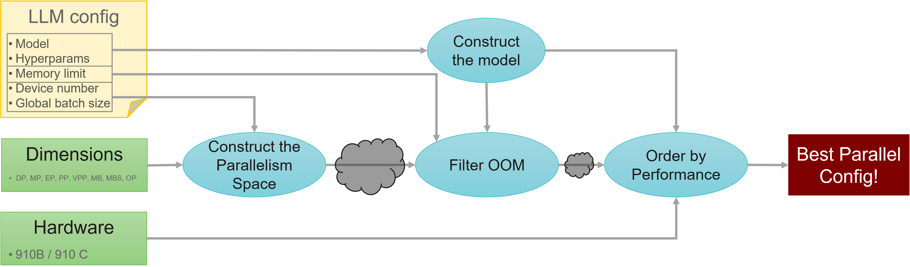
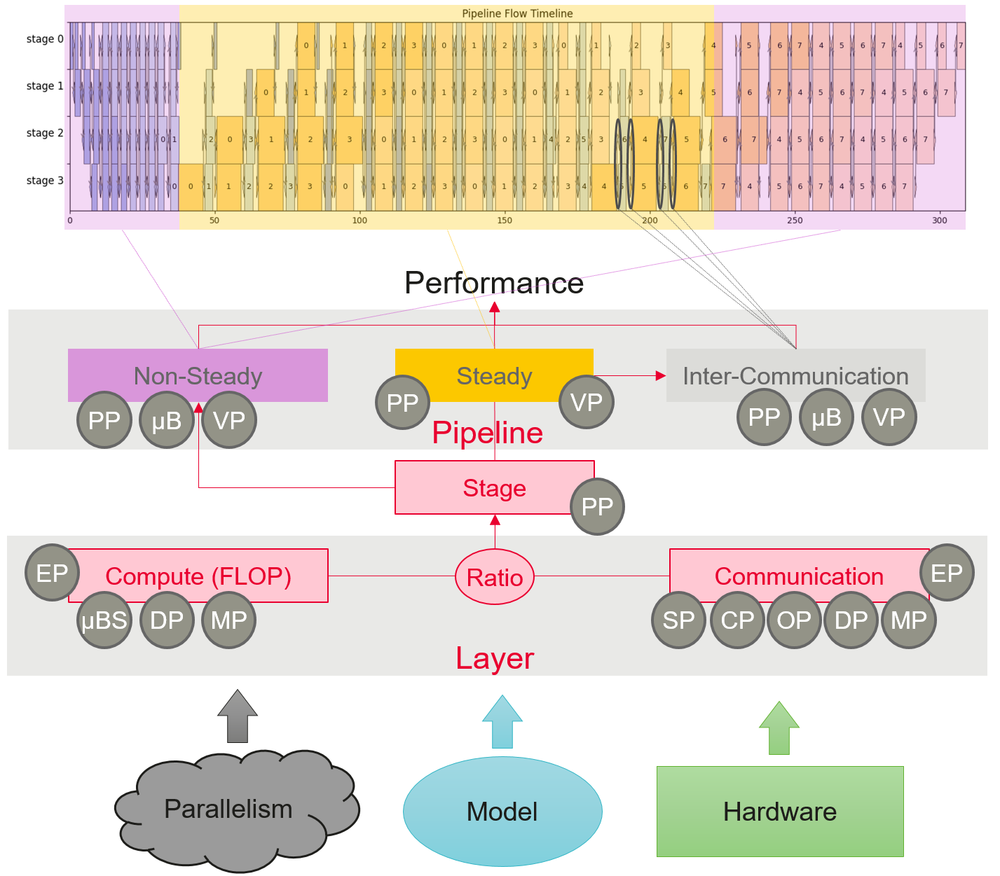
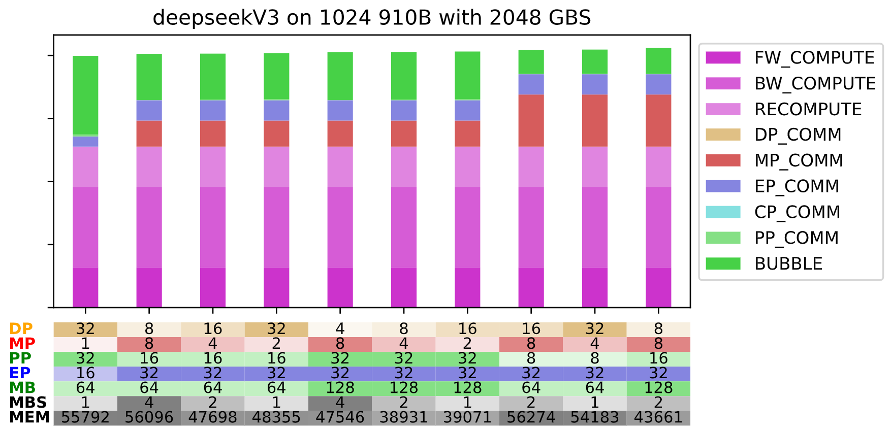

# ND: parallelizing N Dimensions with symbolic estimation

## 1. Overview

ND is a tool providing a degree to *N* parallelism dimensions, also known as *ND*.
It generates all parallelism possibilities, filters those out of memory thanks to the memory estimation and orders the remains thanks to the performance estimation.
As both estimations are analytic (symbolic), no online profiling of any kind is involved, thereby enabling 
- Exhaustive exploration $\to$ All configuration are estimated
- Very fast exploration $\to$ Seconds
- No reliance on the execution cluster $\to$ Only CPU



### A. Inputs
 
- Large Language Model (LLM)
- LLM configuration (hyperparameters)
- Output Dimensions
- Hardware

### B. Steps
**1. Construct the model**: Several models & layers types are defined within ND. Which to use is defined in the LLM config by default or can be specified in the ```--model``` option. The operators and tensors shapes and data types as well as some features are filled from the hyperparameters specified in the LLM config.
**2. Construct the Parallelism Space**: The parallelism space is constructed for a given set of output dimensions (```-l```). Each of those dimensions need to respect their own constraints and respect the given *device number* (```-d```) and *global batch size* (```-b```).
**3. Filter Out-of-Memory configs**: Among all the possible parallelism configurations generated by the previous step, not all of them fit in the given memory limit. Filtering those that do not is the responsibility of the memory estimation. More information can be found in ```../memory_estimation/README.md```.
**4. Order configs by Performance**: The remaining parallelism space is then ordered by performance thanks to the performance estimation whose overview can be peeked below.



## 2. How to use

### A. Installation
- This software is intended to be used with Python 3.9.
- Packages required may be quickly installed with ```pip install -r requirements.txt```.
- The root of this repository is expected to be in the python path. It can be added with:
```bash
export PYTHONPATH=<toolkits_dir>:${PYTHONPATH}
```

### B. Example
Here is a basic example running ND on a DeepSeekV3 with the following command:

```bash
python run_paradise.py -y yamls/ds/deepseek.yaml -l DP MP PP EP MB MBS -d 1024 -b 2048 -t 10 
```

It varies Data Parallel, Model (Tensor) Parallel, Pipeline Parallel (stages number), Expert Parallel, Micro Batch number, and Micro Batch Size with option ```-l```. This variation will maintain the fix number of 1024 devices (here 910B by default) and 2048 global batch size with option ```-d``` and ```-b```. It will show the top 10 configuration in its output, as specified in field ```-t```.
The previous command outputs the following logs:

```bash
Paradise [parallelize.py:459] - OUTPUT - 1947 valid configurations generated
Paradise [parallelize.py:460] - OUTPUT - 175 configuration fitting memory to order
Paradise [parallelize.py:759] - OUTPUT - Top 10 configurations:
        DP    MP    PP    EP    MB    MBS   Memory    Performance score         FW      BW      Rec     DP      MP      EP      CP      P2P     BBL
        32    1     32    16    64    1     55792 MB  1.9971555427234972e+16    15.98%  31.97%  15.98%  0.00%   0.00%   4.04%   0.00%   0.79%   31.24%
        8     8     16    32    64    4     56096 MB  2.0129660564310884e+16    15.86%  31.72%  15.86%  0.00%   10.26%  8.01%   0.00%   0.10%   18.20%
        16    4     16    32    64    2     47698 MB  2.014470914794442e+16     15.85%  31.69%  15.85%  0.00%   10.25%  8.00%   0.00%   0.20%   18.16%
        32    2     16    32    64    1     48355 MB  2.018172165181606e+16     15.82%  31.64%  15.82%  0.00%   10.23%  7.99%   0.00%   0.39%   18.12%
        4     8     32    32    128   4     47546 MB  2.0258604245354388e+16    15.76%  31.52%  15.76%  0.00%   10.20%  7.96%   0.00%   0.10%   18.71%
        8     4     32    32    128   2     38931 MB  2.027410003488528e+16     15.75%  31.49%  15.75%  0.00%   10.19%  7.95%   0.00%   0.20%   18.68%
        16    2     32    32    128   1     39071 MB  2.031201070864804e+16     15.72%  31.43%  15.72%  0.00%   10.17%  7.94%   0.00%   0.40%   18.63%
        16    8     8     32    64    2     56274 MB  2.044922615715428e+16     15.61%  31.22%  15.61%  0.00%   20.20%  7.88%   0.00%   0.10%   9.37%
        32    4     8     32    64    1     54183 MB  2.046657690169238e+16     15.60%  31.20%  15.60%  0.00%   20.18%  7.88%   0.00%   0.19%   9.35%
        8     8     16    32    128   2     43661 MB  2.0594362898819456e+16    15.50%  31.00%  15.50%  0.00%   20.06%  7.83%   0.00%   0.10%   10.01%

Paradise [parallelize.py:762] - OUTPUT - Space generation took 5.15s and ordering took 0.48s
Paradise [parallelize.py:768] - OUTPUT - Offset & Recompute were NOT computed from yaml info
Paradise [parallelize.py:771] - OUTPUT - Device number is 1024, global batch size is 2048, dimensions are [DP, MP, PP, EP, MB, MBS]
```

And the following plot: 



### C. Complete usage
```
$ python run_paradise.py --help
usage: python run_paradise.py 
        [-h] -y YAML_CONFIG [-d DEVICES] [-b GLOBAL_BATCH_SIZE] [-m MODEL] 
        [-l [DIMENSIONS ...]] [-v VERBOSITY] [-A DEVICE_TYPE]
        [-mppb | -–manual_pipeline_balance] [-t TOP_CONFIG_NUMBER] [-mem MEM_FOR_PPB]

Provides a degree to N parallelism dimensions

optional arguments:
  -h, --help            show this help message and exit
  -y YAML_CONFIG, --yaml_config YAML_CONFIG
                        Path to yaml configuration file
  -d DEVICES, --devices DEVICES
                        Number of devices. Takes yaml value if unspecified
  -b GLOBAL_BATCH_SIZE, --global_batch_size GLOBAL_BATCH_SIZE
                        Global batch size. Takes yaml value if unspecified
  -m MODEL, --model MODEL
                        Model Name to use. Takes yaml value if unspecified
  -l [DIMENSIONS ...], --dimensions [DIMENSIONS ...]
                        list of varying (output) dimensions
  -v VERBOSITY, --verbosity VERBOSITY
                        Level of verbosity in range [0,6], 0 being no output and 6 being 
                        debug level output. Plot and debug csv are generated from 2
  -A DEVICE_TYPE, --device_type DEVICE_TYPE
                        choose device type between A2 or A3
  -mppb, -–manual_pipeline_balance
                        Takes offset and recompute from yaml (default: False)
  -t TOP_CONFIG_NUMBER, --top_config_number TOP_CONFIG_NUMBER
                        Number of top configs to print & plot
  -mem MEM_FOR_PPB, --mem_for_ppb MEM_FOR_PPB
                        Memory to reserve for pipeline balancing. 
                        Will be decreased from the memory budget allowed by ND (default 0GB)
```

## 3. Structure

```bash
Paradise/
├── common/                         # Directory containing python files used by several modules
│   ├── framework_parsers           # Parsers for configs of different frameworks
│   ├── _cost_model_variables.py    # All configuration variables used by the estimations
│   ├── arch_hooks.py               # Custom variables per model (expert knowledge)
│   ├── config.py                   # yaml config reader
│   ├── cost_model_preprocess.py    # Parse config into cost model
│   ├── generate_partitions.py      # Generate pipeline partitions for estimations
│   ├── hardware.py                 # Hardware and device information and treatment
│   ├── layer_type.py               # Layer
├── output/                         # Output directory with plots & csv treatment record
├── results/                        # Real runs results directory. Used for tests & validation
├── yamls/                          # Yaml configuration directory
├── balancing_adapter.py            # Adapt the given pipeline balancing to a different pipeline configuration
├── debug.py                        # Debug utilities for csv treatment record & plots
├── dimensions.py                   # Parallelism dimensions
├── global_config.py                # Configuration including parallelism dimensions
├── logger.py                       # Logger definition
├── parallelize.py                  # Main file: space generation and call to memory & performance estimations  
├── README.md                       # This file
├── requirements.txt                # repository of all python packages used for quick environment setup
├── run_paradise.py                 # Entry point of ND. Calls parallelize.py
├── run_test.py                     # Test for non regression
└── run_validation.py               # Validation protocol
```

## 4. Validation

As a validation protocol, we chose several sets of tests. Each of those sets stems from the same yaml, device type & number, and global batch size. What varied were the parallel dimension degrees. All those tests were conducted on real machines and the performance recorded in a csv (in ```results``` directory). 
A test set is considered valid if ND select the parallelism with the perf performance among all those tested (i.e. TopPos = 1). All those tests can be run from ```run_validation.py```. The yamls, corresponding csvs, and complete protocol can also be found in that file.
Here is its output:
```bash
$ python run_validation.py
Model name    Machine Devices GBS     Test    TopPos  Varying Dimensions
llama2_7b     910B    8       8       7       1       [DP, MP, PP, MB]
llama2_7b     910C    8       8       7       1       [DP, MP, PP, MB]
llama2_13b    910B    32      64      12      1       [DP, MP, PP, MB]
qwen2_72b     910B    64      64      6       1       [DP, MP, PP, MB]
deepseekV3    910C    64      8       7       1       [DP, MP, PP, MB, EP]
deepseekV3    910C    128     1920    4       1       [DP, EP, MP, MB]
CustomerA     910B    128     128     3       1       [EP]
CustomerA     910B    1536    1024    8       1       [DP, MP, PP, OP, MB]
CustomerB     910B    32      256     3       1       [MB, MBS]
CustomerB     910B    128     256     5       1       [DP, EP, MP]
CustomerB     910B    128     128     3       1       [EP]
```

## 5. Current State & Future Work

### A. LLM config
- [x] Configuration of Mindspore/Mindformers (in yaml format) 
- [x] Configuration of Megatron (in json format)
- [ ] Configuration of Torch Titan (in toml format)

### B. Models
- [x] **Transformer**: Llama-series, Qwen-series (up to 2.5)
- [x] **Mixture-of-Experts**: DeepSeekV3 
- [ ] **Multimodal**: in progress

### C. Hardware
- [x] Ascend 910B ```A2``` [default]
- [x] Ascend 910C ```A3```
- [ ] Ascend 910D ```A5```
- [ ] GPU 

### D. Output Dimensions
#### Parallelism dimensions
- [x] Data Parallelism ```DP```
- [x] Model (*Tensor*) Parallelism ```MP```
- [x] Megatron's Sequence Parallelism ```SP``` 
- [x] Expert Parallelism ```EP``` 
- [x] Pipeline Parallelism ```PP``` 
- [x] Optimizer (*ZeRO-DP*) parallelism ```OP```
- [ ] Context Parallelism ```CP``` 
#### Batch dimensions
- [x] Micro Batch number ```MB``` 
- [ ] Micro Batch Size ```MBS```
#### Pipeline scheduling
- [x] Virtual Pipeline Parallelism ```VPP```